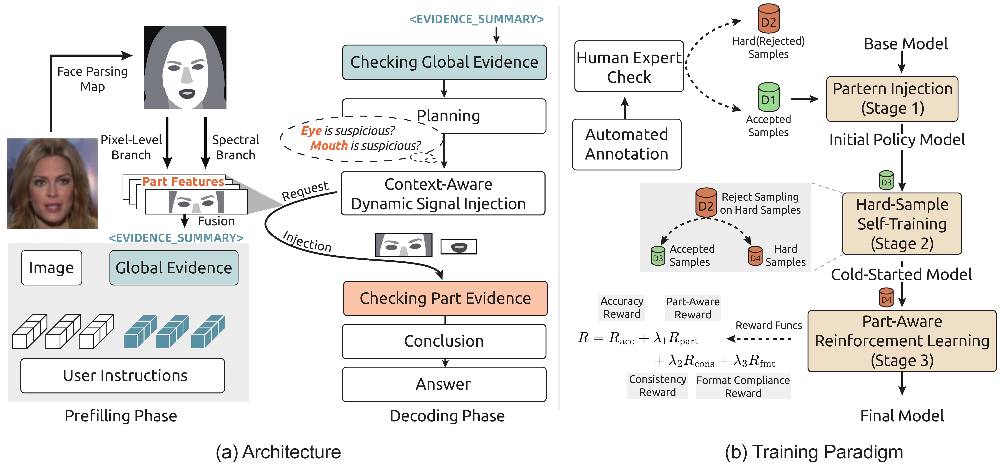
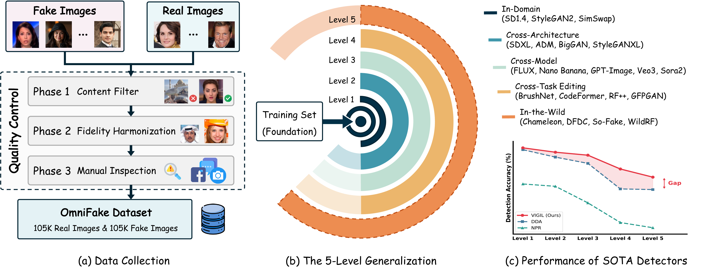

<div align="center">

# VIGIL: Part-Grounded Structured Reasoning for Generalizable Deepfake Detection

[Paper](https://arxiv.org/abs/2603.21526) &nbsp;|&nbsp; [Project Page](https://vigil.best/) &nbsp;|&nbsp; [OmniFake Dataset]() &nbsp;|&nbsp; [Model Weights]()

</div>

## Overview

**VIGIL** is a part-centric structured forensic framework for interpretable and generalizable deepfake detection. Current MLLM-based detectors combine evidence generation and manipulation localization in a single step, blurring faithful observations and hallucinated explanations. VIGIL decouples them through a **plan-then-examine** pipeline: the model first plans which facial parts to inspect based on global visual cues, then examines each part with independently sourced forensic evidence via **stage-gated injection**. A progressive three-stage training paradigm (SFT → hard-sample self-training → RL with part-aware rewards) ensures genuine evidence reasoning rather than template memorization.

We also introduce **OmniFake**, a hierarchical 5-Level benchmark (200K+ images) for fine-grained generalizability evaluation, where the model is trained on only three foundational generators and progressively tested up to in-the-wild social-media data.

### Highlights

- **Part-Grounded Reasoning** — Every forensic claim is anchored to a specific facial part, decoupling claims from evidence to eliminate hallucination.
- **Stage-Gated Injection** — Part-level forensic signals (frequency-domain + pixel-level) are delivered only during examination, preserving autonomous planning.
- **Reasoning Reversion** — Accumulated part-level evidence can overturn an initially incorrect global judgment.
- **OmniFake Benchmark** — 5-Level hierarchical evaluation from in-domain to in-the-wild social-media data.

## Method

<div align="center">

</div>

| Stage | Description |
|:---:|---|
| **Plan** | Observe global visual cues and select which facial parts to inspect — without exposure to external forensic signals. |
| **Examine** | Inject frequency-domain and pixel-level evidence into each selected part via stage-gated mechanism. |
| **Synthesize** | Aggregate part-level findings into a final verdict, with the ability to overturn initial judgments. |

**Training**: (1) SFT on signal-semantic annotations, (2) hard-sample self-training via rejection sampling, (3) RL with part-aware & evidence-conclusion consistency rewards (GRPO).

## OmniFake Benchmark

| Level | Name | Description |
|:---:|:---:|---|
| L1 | In-Distribution | Same generators as training |
| L2 | Cross-Architecture | Unseen models within related paradigm families |
| L3 | Cross-Model | Entirely unseen generation principles (flow matching, autoregressive, commercial generators, etc.) |
| L4 | Cross-Task | Localized manipulation (inpainting, face restoration) |
| L5 | In-the-Wild | Social media, unknown methods & real-world degradations |

<div align="center">

</div>

## Main Results

Accuracy (%) on OmniFake. **Bold** = best, underline = second best.

| Method | L1 | L2 | L3 | L4 | L5 | Avg. |
|---|:---:|:---:|:---:|:---:|:---:|:---:|
| AIDE (ICLR'25) | 72.3 | 89.1 | 81.6 | 67.6 | 75.0 | 78.9 |
| Co-SPY (CVPR'25) | 83.5 | 89.9 | 89.0 | 71.3 | 82.5 | 84.7 |
| DDA (NeurIPS'25) | 97.8 | 94.6 | 91.9 | 81.0 | 80.7 | 88.8 |
| GPT-5.2 | 65.8 | 82.7 | 73.6 | 58.8 | 69.0 | 71.4 |
| Gemini-3-Pro | 72.3 | 85.9 | 78.5 | 61.0 | 69.9 | 75.0 |
| FakeVLM (NeurIPS'25) | 83.5 | 81.0 | 76.8 | 74.5 | 74.9 | 77.1 |
| Veritas (ICLR'26) | 96.8 | 94.9 | 89.9 | 79.0 | 81.1 | 87.6 |
| **VIGIL (Ours)** | **98.6** | **96.7** | **95.5** | **89.5** | **86.0** | **93.1** |

## Code & Data

> We are currently organizing the code and data. Stay tuned!

| Resource | Status |
|---|---|
| Training & Inference Code | Coming Soon |
| Model Weights | Coming Soon |
| OmniFake Dataset | Coming Soon |
| Demo | Coming Soon |

## Citation

If you find our work useful, please consider citing:

```bibtex
@article{vigil2026,
  title={VIGIL: Part-Grounded Structured Reasoning for Generalizable Deepfake Detection},
  author={Li, Xinghan and Xu, Junhao and Chen, Jingjing},
  year={2026}
}
```

## License

This project is released under the [Apache 2.0 License](LICENSE).
